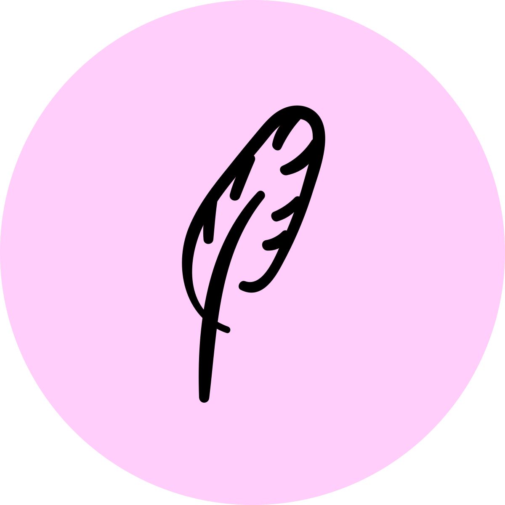

<h1 align="center"></h1>

Feather is a very, _very_ early stage React component library.

Focuses on providing a nice developer experience for building accessible, and good looking
apps with React.

It also serves as...

-   Test bed for [Nova](https://github.com/aslilac/nova) (my build tool for React libraries)
-   Test bed for [Chic](https://github.com/aslilac/chic) (my SCSS-in-JS library for React)
